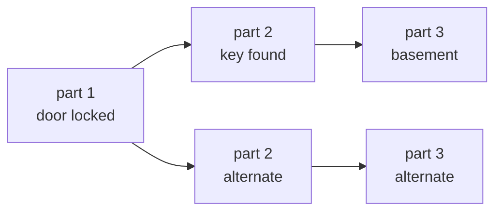

# Project Anubhuti

An AI writers room for serialized audio drama, with an **Engagement Survival
Forecast** that tells a writer where an episode is likely to lose people, why,
and what one change would help — then voices the approved ending with delivery
direction derived from that same analysis.

> **Simulated pre-release forecast — informed by narrative-quality and
> emotional signals. It is not calibrated with live listener, retention,
> unlock, or purchase data.**
>
> The forecast reports *relative* proxies. It never claims a percentage of
> real listeners, a conversion rate, or proof of causation. See
> [Limitations](#limitations).

## The workflow

```
Project canon, scoped to one timeline at one point in the story
  → writer adds a continuation
  → story check (contradictions, premature references, dangling threads)
  → scene-level narrative feature analysis
  → Engagement Survival Forecast
  → risk explanation + Cliffhanger Lab
  → writer revises, or forks a new timeline to try something else
  → before / after comparison
  → retention-directed voiced preview of the approved ending
  → export preview audio, manifest, cue sheet, and directing sheet
```

## Projects and branching timelines

A project is one story. A **timeline** is one version of it. When a writer wants
to try a different direction, they fork a new timeline from any earlier part,
and the fork inherits everything before that point and nothing after it.

The hard part is not storing the branches. It is that **the same claim can be
true on one timeline and false on another**, so a plot-hole checker has to know
which timeline it is standing on before it can say anything useful.

### The one rule

Everything the canon knows is an *event* with a branch and a position: a part
being written, a fact being established, a fact ceasing to be true. One
predicate in [`src/projects/visibility.py`](src/projects/visibility.py) decides
whether an event is visible from where the writer is standing, and every other
question reduces to it.

```python
def is_active(fact, branch, position) -> bool:
    return (visible(fact.established, branch, position)
            and not visible(fact.superseded, branch, position))
```

Collapsing branching and supersession into a single rule is what keeps this
small. The alternative — filtering parts by branch in one place and expiring
facts by timestamp in another — gets the interesting case wrong.

### Why it matters, concretely



The claim "the basement door is locked" is established at part 1 and superseded
at part 2. A branch forked before part 2 never saw the key being found.

| Standing on | Establishment visible | Supersession visible | Verdict |
| --- | --- | --- | --- |
| Main timeline | yes | yes | door is open |
| The forked timeline | yes | no | **door is still locked** |

One fact, opposite truth values, from one comparison. Run it yourself:

```bash
python scripts/demo_branching.py
```

That script builds the three-part story, forks a timeline before the key is
found, and runs **the same draft** against both. Main comes back clean. The
branch reports eight problems, including that the draft refers to a character
and a location that only exist on the timeline it never followed.

### Two layers of canon

Similarity search cannot represent a claim that stopped being true, so canon is
split by what each layer is actually good at.

| | Fact ledger | Passages |
| --- | --- | --- |
| Holds | structured claims with a lifecycle | embedded prose |
| Answers | is this still true here | how did this feel, who talks like this |
| Lives in | local SQLite + exact cosine in numpy | Databricks Vector Search |
| Needs | nothing | a running SQL warehouse |

Facts are local because supersession needs `UPDATE`, which a Delta Sync index
handles poorly; because a few hundred rows make an exact dot product both faster
and more accurate than an approximate index; and because newly finalised canon
is queryable immediately, with no sync lag. Databricks being unreachable costs
passage recall and nothing else — the story check keeps working offline.

Passages go to a **new** table, `main.anubhuti.project_canon`, rather than a
change to the existing `story_lore`. That table has no project or branch column,
and adding one would mean rebuilding the index the original Writers Room
continuity path depends on. `src/lore_engine/` is untouched.

### What the story check looks for

Three of the four checks need no model at all, and the deterministic ones are
ranked above the probabilistic one because they are the ones you can verify by
hand.

| Check | How | Catches |
| --- | --- | --- |
| Contradiction | one `gpt-4o-mini` call, against **active facts only** | walking through a door that is locked *on this timeline* |
| Premature reference | deterministic | using the key before it is found, or naming a character who only exists on another branch |
| Dangling question | deterministic | a mystery opened four parts ago and never answered |
| Answer without a question | deterministic | resolving something never raised here, usually the sign you are on the wrong timeline |

The contradiction check only ever sees facts that are active at this point on
this timeline. A superseded claim is not filtered out of the results — it never
becomes a candidate, so the false positive cannot be raised in the first place.
[`tests/test_projects.py`](tests/test_projects.py) asserts exactly that: on the
main timeline, zero facts reach the adjudicator and no model call is made.

## Four independent evidence layers

No single prompt is asked to impersonate an audience. Four separate sources of
evidence feed a transparent hazard model, and the UI shows which is which.

| Layer | Module | What it is |
| --- | --- | --- |
| **1. Scene DNA sensor** | `retention_engine/scene_features.py` | One cheap `gpt-4o-mini` structured reading per scene. Written as an instrument, not a critic: it measures pacing, emotion, craft, content, and narrative axes with explicit calibration anchors, and is forbidden from judging quality. |
| **2. Structural signals** | `retention_engine/structural_features.py` | Deterministic, local, model-free. Sentence statistics, dialogue ratio, POV dominance, question density, time-pressure terms, hook markers, exposition streaks, and a running **payoff debt** ledger. Reproducible and free. |
| **3. Narrative quality prior** | `retention_engine/quality_proxy.py` | TF-IDF + Ridge trained on `lars1234/story_writing_benchmark`. A **story-quality proxy, not a retention label**. |
| **4. Target-cohort fit** | `retention_engine/target_cohort.py` | The writer declares who they are writing for. That becomes a numeric preference vector, plus three labelled what-if cohorts. |

These feed `engagement_forecast.py`, a hand-specified hazard model. Every term
is a named constant times a measured signal, and every term that fires is
returned as evidence:

```
hazard = baseline
       + pace mismatch + complexity overshoot + exposition overshoot
       + exposition fatigue + low event movement + emotional flatness
       + quality-prior penalty + payoff debt + POV fatigue + content overshoot
       − cohort alignment − earned cliffhanger lift − meaningful progression
```

Survival starts at 100 and decays multiplicatively. It is reported as
"Relative survival proxy: 72 / 100", never as a listener percentage.

## What you get

- **Engagement Survival Proxy** — primary cohort curve plus three counterfactual
  scenario curves, with risk scenes shaded.
- **Narrative EKG** — tension, emotional intensity, event movement, quality
  prior, exposition, and cliffhanger strength across the episode, with payoff
  debt as bars and markers for high-risk scenes, the strongest hook, major
  reveals, exposition fatigue, and unresolved payoff.
- **Cliffhanger Lab** — ending type (danger, revelation, betrayal, decision,
  countdown, disappearance, false resolution, weak/resolved), a component
  breakdown, and an **Unlock Pull Index**.
- **Risk evidence** — per scene, the hazard arithmetic in a table, then
  *why this scene is risky*, *what the target cohort expects*, *a surgical fix*,
  and *the trade-off* for other cohorts.
- **Before/after comparison** — every headline metric, per-scene risk movement,
  named structural evidence, and a before/after curve overlay.
- **Retention-directed audio preview** — a 60–90 second voiced preview of the
  ending where each chunk carries a delivery instruction, a target speech rate,
  and a pause-before-reveal, all derived from the forecast.

## Setup

Requires Python 3.11+, an OpenAI API key, and (for the lore layer) a Databricks
workspace with Unity Catalog and Vector Search.

```bash
git clone https://github.com/Aardy-Bond/ZeroToOne.git
cd ZeroToOne

python3 -m venv .venv
source .venv/bin/activate
pip install -r requirements.txt

cp .env.example .env   # then fill in your values
```

Optional, for the lore continuity layer:

```bash
databricks auth login --host https://<your-workspace>.cloud.databricks.com
PYTHONPATH=src python -m lore_engine.setup_vector_db
```

### Train the quality prior (one command)

```bash
python scripts/train_quality_proxy.py
```

Downloads `lars1234/story_writing_benchmark`, fits TF-IDF + Ridge on the
English subset, and writes `models/quality_prior.joblib` plus a metadata file
recording the dataset, label, timestamp, sample count, and feature version.
Takes about 20 seconds on CPU. Neither the dataset cache nor the artifact is
version controlled.

If you skip this, everything still works: the sidebar shows "Quality prior —
not trained" and the hazard model **omits the quality term entirely** rather
than substituting a guess.

## Running it

```bash
streamlit run src/dashboard/app.py
```

Four pages:

- **Library** — your stories. Start a new one from scratch, or paste in a story
  you have already begun and it will be read into canon.
- **Write** — where you work. It asks one question before anything else, then
  becomes a desk. Described below.
- **Timelines** — the branch tree, and a comparison of what any two timelines
  hold as true. The differences here are exactly what the story check will hold
  you to.
- **Production** — the original expert panel, synthetic audience heatmap,
  auto-rewrite, and voiced audio, working from the current draft.

### Opening a story asks where you are continuing from

Not which file to open — *which point in the story*. The map appears first and
you pick the part you are writing after.

This is in front rather than tucked in a sidebar because in a branching story
the answer is not obvious and it changes everything downstream: which parts you
inherit, which facts are true, and whether finalising extends this timeline or
starts a new one. Picking the end of a timeline continues it. Picking anywhere
earlier means you are writing an alternative, so the page says so before you
write a word, asks what to call the new timeline, and keeps a reminder in the
header until you finalise.

Nothing is overwritten either way, and the fork is only created when you
finalise — abandoning a draft leaves no empty timeline behind.

### Then it becomes a desk

The recap, the established facts, and the open threads sit behind three chips
along the top. All three are worth a glance twice an hour and none is worth
permanent screen space, so opening one is a click and the writing surface keeps
the room. Results appear underneath only once you ask for them.

The editor knows it is a screenplay. Scene headings and character cues can be
added without remembering the format, the character list is drawn from who has
actually spoken in earlier parts, and a live strip shows words, scenes, voices,
and spoken runtime — runtime being the number an audio writer works to.

**How this will be read** is the part worth knowing about. It shows the scenes
the analysis will see and the lines that will actually be performed, and it
flags cues that are really stray description. See
[Screenplay formatting](#screenplay-formatting) for why that matters.

The interface speaks in a writer's terms. "Readers still with you" is the
engagement survival proxy, "pull to the next part" is the Unlock Pull Index, and
every original number is one click away under **Show the analysis**. Nothing is
rounded into a claim it cannot support; only the label changes.

## Test material

The bundled samples are short enough to demo and too short to stress anything.
Two sources of harder material:

### Long public-domain novels

```bash
python scripts/fetch_corpus.py --list
python scripts/fetch_corpus.py hound --parts 6
```

Eight Project Gutenberg books, each picked because it breaks something
different. Chapters are split out into `samples/corpus/<slug>/part_NN.txt`,
with the licence boilerplate stripped, the hard-wrapping reflowed into real
paragraphs, and the table of contents discarded.

| Book | Words | What it stresses |
| --- | --- | --- |
| `dracula` | 164k | The fact ledger. Lucy goes alive → ill → dead → walking → at rest: four supersessions on one subject. Epistolary and dated. |
| `moonstone` | 198k | The contradiction adjudicator's false-positive rate. Narrators disagree in good faith. |
| `hound` | 62k | Dangling questions and payoff debt. A mystery is a machine for opening questions and paying them off late. Best value for its length. |
| `frankenstein` | 78k | Scene splitting under a frame story — three nested narrators, no headings. |
| `jekyll` | 29k | A cheap end-to-end run before spending money on Dracula. |
| `woman-in-white` | 240k | Scale, and two characters deliberately confused with each other. |
| `treasure-island` | 71k | The engagement forecast. Violent swings between exposition and action. |
| `turn-of-the-screw` | 43k | Ambiguity as an adversarial case: the text refuses to confirm facts the ledger will assert anyway. |

Each part you finalise costs one fact-extraction call plus embeddings, so start
with three or four rather than `--all`.

### A story with known faults

`samples/kestrel/` is six parts of deliberately broken fiction, with
`EXPECTED.md` documenting every planted trap. Real novels are internally
consistent, which makes them useless for testing a plot-hole finder — it should
find nothing, and if it finds nothing you have learned nothing.

Planted in it: a four-state supersession chain, a contradiction five parts wide
(Ilse cannot swim in Part One and swims in Part Six), a premature reference, an
unanswered question, an answer to a question nobody asked, a restatement trap,
and — importantly — **a near-miss that must not be flagged**, where a dead man's
name is called at a roll and his son answers.

It also carries a deliberate exposition sag. Measured: Part Three's material
lands as the two highest-hazard segments in the story at 0.450 against 0.005 to
0.187 elsewhere, on exposition 0.90 and tempo 0.20 with no conflict.

Run the whole thing without pasting anything by hand:

```bash
python scripts/run_kestrel.py
```

It ingests all six parts, checks each one against canon as it stood before it,
forks a timeline to show the same ending judged two ways, and writes the branch
map, Narrative EKG and survival curve to `output/charts/`.

### Grading the checker against stories whose faults are known

A plot-hole finder cannot be judged by reading its output and nodding. Each
fixture under `samples/fixtures/` declares in `expectations.json` what should be
found and, just as importantly, what should not be, and the grader scores one
against the other:

```bash
python scripts/grade_fixtures.py              # all fixtures
python scripts/grade_fixtures.py ardmore      # one of them
```

Grading is strict: a finding matching no declared trap counts against precision,
because a warning the writer has to dismiss is worse than no warning at all — it
teaches them to stop reading the panel.

| Fixture | Form | What it is for |
| --- | --- | --- |
| `ardmore` | prose, 4 parts | **The control.** Nothing is wrong with it. Every finding is a false positive. |
| `halberd` | screenplay, 5 parts | Possession, knowledge and location faults, each sitting next to a legitimate move of the same shape. |
| `kestrel` | prose, 6 parts | The original adversarial story, reasoning in `samples/kestrel/EXPECTED.md`. |

The control matters most. It is full of shapes that had been making the checker
fire: a dead man who speaks at length in a remembered scene, an object that
changes hands for a good reason, a question asked in part one and answered in
part four. Anything can find faults in a broken story; staying quiet on a
working one is the harder half, and it is the half a writer notices.

**Grade the same story three times and you will get three answers.** Across
consecutive runs of an unchanged Kestrel, the swim contradiction was found,
found, then missed; the unanswered manifest signature was found once in four;
the Halberd knowledge reversal appeared only on the third attempt. The cause is
upstream of the checks: fact extraction is a language model reading prose, so
which claims get written into the ledger differs run to run, and a check can
only trip over a fact that was recorded. Shown the relevant fact directly, the
adjudicator judges these cases correctly nearly every time. Treat a single
grading run as one sample, not a score, and read the false-positive count —
which is far steadier — as the more meaningful half.

Running the fixtures found six bugs that reading the output had not:

- The adjudicator called a change *shown on the page* a contradiction — Nuala
  giving away the watch was reported as clashing with her having worn it.
- It called a past event a standing condition, so a character sitting in a car
  "contradicted" his having climbed a staircase two parts earlier.
- Reconciliation retired open questions nothing had answered, which silently
  zeroed payoff debt and left the dangling-thread check with nothing to report.
- Supersession recall collapsed with list length: shown four facts it retires a
  repaired lift every time, shown thirty it sailed past, and the stale fact
  surfaced two parts later as a false contradiction.
- A question re-asked in different words was recorded as a second thread.
- Premature-reference detection on a single timeline was almost all noise.

Two of those were fixed by rewording a prompt. The other four were not: the
model agreed with each rule in plain words and then broke it anyway, so the
reasoning is now requested as structured fields and applied in code. False
positives on the Kestrel story fell from ten to one, and on Halberd Street from
fourteen to two, without the adjudicator becoming more suspicious — only more
answerable.

## Demo walkthrough

### The branching canon

```bash
python scripts/demo_branching.py
```

Builds a story where a door is locked at part 1 and unlocked at part 2, forks a
timeline from before the key is found, then runs the same draft against both.
Main comes back clean. The branch reports the door still shut, plus references
to a character and a location that exist only on the timeline it never
followed.

### The engagement forecast

Load `samples/wexler_street_continuation.txt` from the New Story dialog — seven
scenes with a deliberately weak middle.

1. **Read it through.** On the Write page, press **Read it through**.
2. **Find the risk.** Scene 3 lands in the high-risk band: exposition around
   70%, no active conflict, near-zero emotional intensity. Under *Show the
   analysis*, the EKG shows exposition fatigue carrying into scene 4 and payoff
   debt climbing to five open threads by the ending. The counterfactual curves
   disagree sharply — the fast-pace what-if punishes the records-office scenes
   far harder than the slow-burn one.
3. **Apply the surgical fix.** Read the fix for scene 3 and edit the draft, or
   use **Rewrite the weak minutes** on the Production page.
4. **Compare.** Press **Read it through** again. The comparison reports the
   delta and, importantly, says when a change is smaller than the band the
   measurement naturally varies by.
5. **Hear the ending.** Press **Hear the ending** to voice it through
   `gpt-4o-mini-tts` with per-chunk delivery instructions and speech rates.
6. **Inspect the directing sheet.** Each chunk shows its narrative role, risk
   band, dominant emotion, tempo, pause-before-reveal, performance note, and
   foley. Download `preview_manifest.json` and the cue sheet.

## Command line

```bash
PYTHONPATH=src python test_full_pipeline.py --help   # writers room pipeline
PYTHONPATH=src python test_writers_room.py
PYTHONPATH=src python test_audience_simulator.py
```

## Tests

```bash
python -m pytest
```

173 offline tests. No network calls and no API keys: the OpenAI and TTS clients
are replaced with fakes that record what they were asked to do. Coverage spans
scene splitting (screenplay and prose), strict Scene DNA validation, structural
signals, quality-prior loading and its unavailable fallback, cohort vectors,
deterministic hazard output, cliffhanger classification and payoff debt,
before/after deltas, directing-sheet generation, and backward compatibility of
the original production manifest.

Sixty-one of those cover branching, and they are written to be read rather than
merely to pass, because a wrong answer there means the plot-hole checker
confidently reports fiction.
[`tests/test_visibility.py`](tests/test_visibility.py) is the specification for
the visibility rule: fork points are exclusive, a grandchild inherits the
tighter cap rather than widening back out, siblings cannot see each other, and
the locked door is open on main while still shut on the branch.
[`tests/test_projects.py`](tests/test_projects.py) covers the store, the ledger,
and all four checks end to end.

### Page smoke test

```bash
python scripts/smoke_pages.py
```

Renders all five pages against a seeded project and reports any exception. The
offline suite cannot reach page code, and a booting server returning HTTP 200
proves only that the server started — this is what actually caught the pages
colliding on a shared URL because every view's entry point is named `render`.

### Integration tests (real network)

```bash
python -m pytest -m integration                     # everything
python -m pytest -m "integration and not TestOpenAILive"   # free: no API spend
```

12 tests against live services, excluded from the default run because they cost
money and fail offline. Each dependency skips independently, so the suite still
runs with only some of them available:

| Needs | Checks |
| --- | --- |
| Hugging Face Hub | `story_writing_benchmark` still exposes `story_text` and `overall_score`; the trained artifact's metadata matches the dataset it claims |
| Cached GoEmotions weights | the classifier path is selected, never lowers a Scene DNA axis, keeps scene-to-scene variation, and excludes `neutral` from displayed labels |
| `OPENAI_API_KEY` | the sensor separates a tense scene from an exposition dump, the forecast flags the sample's planted weak scene 3, counterfactual cohorts diverge, and deep-dive text contains no percentage, causal, or coin-conversion claims |

To enable the GoEmotions tests, install the optional extras and warm the cache:

```bash
pip install "torch>=2.2.0" "transformers>=4.40.0"
python -c "from transformers import pipeline; pipeline('text-classification', model='SamLowe/roberta-base-go_emotions', top_k=None)"
```

## Screenplay formatting

The parser treats any all-caps line as a character cue and reads the lines
beneath it as dialogue. The failure mode is narrower than it first appears: an
all-caps line with *nothing* under it is dropped harmlessly, so a lone `BEAT`
costs nothing. The one that bites is an all-caps line with a sentence under it:

```
ON THE RADIO
A voice reads the shipping forecast.
```

`ON THE RADIO` becomes a character, and the action line becomes something they
say out loud in the mix. Write them as prose and reserve all-caps lines for
real character names.

The editor flags these for you under **How this will be read**. It detects them
by grammar rather than by counting lines — a cue containing a function word
(`ON`, `THE`, `BACK TO`) is a phrase, not a name — which means a real character
with a single two-word line is left alone.

Scenes split on `INT.` / `EXT.` slug lines. Drafts without them fall back to
paragraph-boundary segmentation, and the UI labels those segments as inferred
so you can see exactly what was measured.

## Data sources and licences

| Source | Licence | Used for | Actually used? |
| --- | --- | --- | --- |
| [`lars1234/story_writing_benchmark`](https://huggingface.co/datasets/lars1234/story_writing_benchmark) | MIT | Narrative quality prior | **Yes** — trained locally |
| [`google-research-datasets/go_emotions`](https://huggingface.co/datasets/google-research-datasets/go_emotions) | Apache 2.0 | Emotion axes, via the pre-trained `SamLowe/roberta-base-go_emotions` | Optional — off by default |
| OpenAI `gpt-4o-mini` | commercial API | Scene DNA sensor | Yes |
| OpenAI `gpt-4o` | commercial API | Writers Room, audience, rewrite, risk deep dive | Yes |
| OpenAI `gpt-4o-mini-tts` | commercial API | Directed voiced preview | Yes |

No model is fine-tuned during this build.

## Limitations

**Why no public dataset can provide real listener retention.** Retention is a
join between story text and per-listener playback telemetry: who started, where
they skipped, where they stopped, whether they came back. That telemetry is
first-party, commercially sensitive, and legally encumbered. Public datasets
give you rated story quality, emotion-labelled sentences, and book ratings —
signals *correlated* with engagement, never engagement itself. Any product
claiming to predict retention from public data alone is either extrapolating
from proxies or making it up. This one extrapolates from proxies and says so.

Specifically:

- **The hazard weights are hand-specified, not fitted.** They encode design
  judgement about what tends to lose listeners. They have never been validated
  against a single real drop-off event.
- **The survival curve's shape is a modelling choice.** Multiplicative decay
  from 100 is a reasonable way to express compounding attention loss; it is not
  a measured hazard function.
- **The quality prior is trained on LLM-written short stories** rated for craft.
  Its R² is around 0.43 on held-out data, and it discriminates only weakly at
  scene length, since it was trained on complete stories. Measured on the sample
  episode it moved **0.01 across five scenes** (0.60–0.62), which is a flat
  line. It is therefore reported as a single number rather than drawn on the
  EKG, and the hazard model weights it as the weak signal it is.
- **The Unlock Pull Index is narrative pull, not conversion.** It deliberately
  produces no paywall recommendation.
- **Cohorts are declared, not measured.** They describe who the writer says they
  are writing for. The counterfactuals are what-ifs, not audience segments.
- **GoEmotions is Reddit comments**, not fiction, and not retention data. Run
  live against this repo's sample, it labelled every scene of a horror episode
  `neutral` at passage level, and at sentence level returned confident but wrong
  labels — `admiration` 0.92 on a body-in-the-floor reveal. It is trained on
  people stating their own feelings in the first person, while narrative prose
  describes events instead. It is therefore wired as corroboration that can only
  *raise* an emotion axis above the Scene DNA reading, never lower one: a
  `neutral` verdict on fiction is an absent reading, not evidence of calm.
  Leaving it authoritative flattened the Narrative EKG to a dead line (arousal
  spread 0.05 against 0.80 for the sensor).
- **Scene DNA is not reproducible, even at temperature 0.** Re-measuring a
  byte-identical episode five times moved the Unlock Pull Index across
  37.4–45.8 (sd 3.25) and overall survival across 40.5–43.7. Individual scenes
  are stable in isolation, but genuinely ambiguous ones flip between calibration
  anchors — `cliffhanger_strength` alternating 0.2/0.5 — which shifts the
  novelty baseline the ending is scored against. Passing a `seed` did not fix
  it; this is OpenAI serving non-determinism, not a configuration mistake.
  The before/after card therefore carries explicit noise bands (±8.5 UPI, ±3.5
  survival) and refuses to call a smaller movement an improvement.

### What the two charts can and cannot tell you

Both were rebuilt after measurement showed they were not communicating. Run
`python scripts/diagnose_charts.py` to reproduce the numbers below on any draft.

The **Narrative EKG** previously drew six 0–1 series on one axis. On a real
episode the quality prior spanned 0.01, tension and emotional intensity tracked
each other almost exactly, cliffhanger strength was 0.00 in three scenes of
five, and every series sat in the lower half of the axis. Six lines, one flat,
two duplicated, one on the floor. The deeper fault was that a bare 0–1 number
has no meaning: tempo 0.22 is only slow *relative to what this audience wants*.

It is now three stacked rows, each autoscaled and each carrying the target
cohort's own preference as a dashed reference — pace target, exposition
tolerance. **The shaded gap between the line and the dashed line is the
reading.** What it cannot tell you is whether the cohort's target is correct;
that is a number you declared in Settings, not one anybody measured.

The **survival curve** had the opposite problem: the content was fine and the
presentation buried it. Four cohort curves all start at 100 and all slope down,
so four near-identical lines said nothing. The counterfactuals now collapse
into a shaded band, which makes the informative thing visible — **where the
band widens, the forecast depends more on your assumption about the audience
than on the writing.** The absolute number is not a percentage of anybody, and
only the shape and the gaps carry meaning.

### Limits of the story check

- **Three of the four checks are deterministic; the contradiction check is
  not.** Premature references, dangling threads, and answers to unasked
  questions are computed from the ledger and are exactly reproducible. Whether
  a draft *contradicts* an active fact is a judgement call made by
  `gpt-4o-mini`, and it occasionally strains to find a clash. Findings are
  ranked with the deterministic ones first for that reason.
- **A part that ends a claim must not re-establish it.** This was a real bug,
  found in a live run and now fixed. Reconciliation deliberately compares a
  part against the facts that held *before* it, so a part cannot supersede its
  own claims — but the extractor reads the same part and would write down
  background it restates on the way past. A part that unlocked a door also
  re-established "Aldous kept the only key," and a draft three parts later was
  flagged for walking through a door that had been open the whole time.
  Reconciliation now runs *before* extraction, and any new claim that restates
  one the same part just ended is dropped
  ([`is_restatement`](src/projects/facts.py)).
- **Fact extraction is only as good as the prose.** Claims stated obliquely, or
  established purely through implication, will not be recorded. The ledger is
  visible and editable on the Write page precisely so a writer can see what the
  tool believes and overrule it.
- **Deaths do not reverse by inference.** Facts of kind `permanent` are never
  superseded by the reconciler, however confidently it asks. Reversing one
  requires showing it on the page.
- **Positions are shared across a lineage, and the fork point is exclusive.** A
  branch forked at 2 writes its own first part *at* 2, and never inherits the
  parent's part 2. This keeps one integer comparison able to order the whole
  tree, but it does mean two timelines can hold different parts at the same
  number. The Timelines page exists to make that visible.
- **A contradiction must quote the draft, and that rule is enforced in code.**
  Told in prose that a draft failing to mention something is not a
  contradiction, the adjudicator returned fourteen findings on one scene, most
  of them phrased as "the draft does not mention this". Naming the failure in
  the prompt only taught it the phrase. It is now made to copy out the sentence
  it is objecting to, the sentence is checked against the draft, and a verdict
  that quotes nothing is discarded. Three rules that had been requests are now
  gates: the fact must be a standing condition rather than a past event, the
  draft must not depict the change itself, and the quote must exist.
- **Nothing looks at retired facts, so a character can rewrite their own past.**
  If a story establishes that Mara does not know Dev is police, then has her
  learn it, then has her claim in a later scene that she knew all along, the
  clash is invisible: the part-one fact was legitimately superseded, and only
  active facts are offered to the adjudicator. Shown that fact directly the
  model calls it correctly every time, so this is a gap in what gets asked
  rather than in the answer. `samples/fixtures/halberd/` holds a worked example.
- **Premature-reference detection only speaks across a fork.** Writing forward,
  a reference to your own future cannot be seen, because the later fact has not
  been written yet. Graded on re-examined parts it was wrong roughly four times
  for each time it was right — part three of the Kestrel story was told it
  referred to the Kestrel Light "which is not established until part four" — so
  same-timeline detection was removed rather than tuned. Across a fork it is
  exact and genuinely useful, which is the case writers hit anyway.
- **Subjects are matched as strings, so one thing can be tracked as several.**
  "The Kestrel Light", "the lamp" and "the light" become three subjects with
  three separate histories. Supersession works within each and not between
  them, which is why the light in that story ends up holding a chronicle of
  dated events rather than one current state.

## Making the forecast real: first-party event schema

Calibrating any of this requires instrumenting playback. The minimum event
schema:

| Field | Purpose |
| --- | --- |
| `story_id`, `story_version` | Tie events to the exact draft that shipped |
| `episode_number`, `scene_index`, `beat_index` | Locate a drop at the granularity the forecast predicts |
| `listener_profile_snapshot` | Cohort attributes *as of playback*, not as of today |
| `listen_start`, `progress_ms`, `completion` | The survival signal itself |
| `skip_event` (from, to, timestamp) | Distinguishes boredom from a hard stop |
| `next_episode_start`, `time_to_next_episode` | Whether the hook actually pulled |
| `paywall_reached`, `unlock_event`, `unlock_declined` | The conversion signal |
| `promotion_context`, `purchase_context` | Separates narrative pull from a discount |

With `story_version` and `scene_index` present, hand-specified hazard weights
can be replaced with a fitted survival model, and the counterfactual cohorts can
be replaced with measured ones. Until then, every number in this product is a
proxy, and the UI says so on every screen that shows one.

## Output

`output/` is gitignored:

- `scratch_audio/`, `production_manifest.json`, `cue_sheet.txt` — the original
  production export, unchanged.
- `preview_audio/`, `preview_manifest.json`, `preview_cue_sheet.txt` — the
  retention-directed preview, including `retention_directing_sheet`.

## Costs

Per full forecast on a seven-scene episode: one `gpt-4o-mini` call per scene,
up to three `gpt-4o` risk deep dives, and one `gpt-4o-mini-tts` call per preview
chunk. The Writers Room tab adds one `gpt-4o` critique, three parallel persona
simulations, and an optional rewrite. Databricks bills the SQL warehouse and the
Vector Search endpoint separately, the latter whenever it is running.
